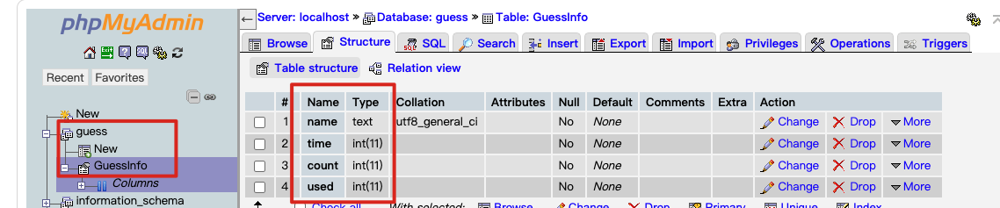

# GuessBeansGame
猜豆子博弈双人小游戏 Demo

## 环境准备
1. 安装 [Vite](https://cn.vitejs.dev/)，用于部署前端网页
2. 准备好 php 和 mysql 环境，将 Guess.php 部署上去。测试时我使用的是 [MAMP](https://www.mamp.info/en/downloads/)
3. 需要提前配好数据库，当然也可以优化为代码创建



## 启动服务
Client：

```sh
cd client
yarn
yarn dev --host # 需要提前安装 vite
```

Server：启动 php 服务，能正常访问 Guess.php 即可

## 使用说明
1. 玩家 A 和 B 需要分别访问不同的链接来开始：`http://192.168.2.103:5173/?name=A` 和 `http://192.168.2.103:5173/?name=B`
2. 每一轮下注后，先下注的玩家需要等到后下注玩家下注完后点击 `催催对手` 来获取对手下注结果
3. 游戏结束后双方需要点击 `重新开始` 进行新一轮的对战

## 效果截图


## 开发笔记
+ 只是 Demo，很多细节尚未完善，比如只考虑了双人（重新开始的逻辑删除了数据库）、需要手动刷新（没有长连接或者轮询）等
+ 未实现公开在线部署
+ 偶现对战时数据混乱
+ 前端的跨域请求，只涉及到 Get 请求，最简单的用 `fetch-jsonp` 可解

## 灵感来源


周五晚上看到这篇文章：[博弈论杂谈：是谁预判了你的预判](https://mp.weixin.qq.com/s/pkFe83sURHY6Jqy91CUfuQ)，周六花了一个下午搞出游戏原型，调试游戏逻辑和搞跨域问题花了不少时间

